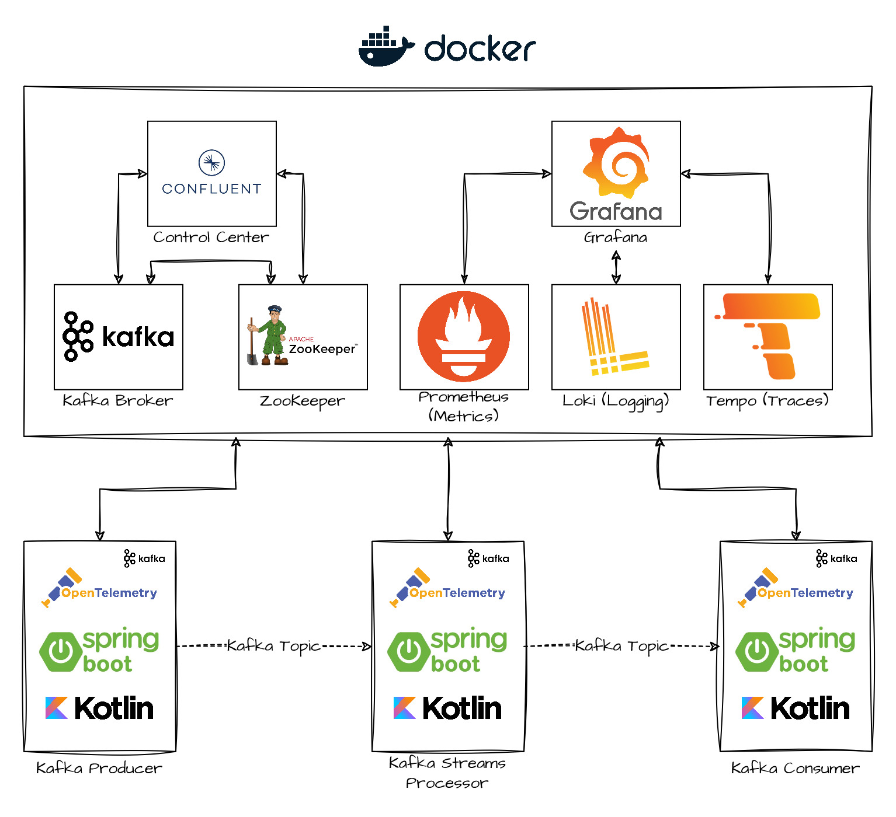
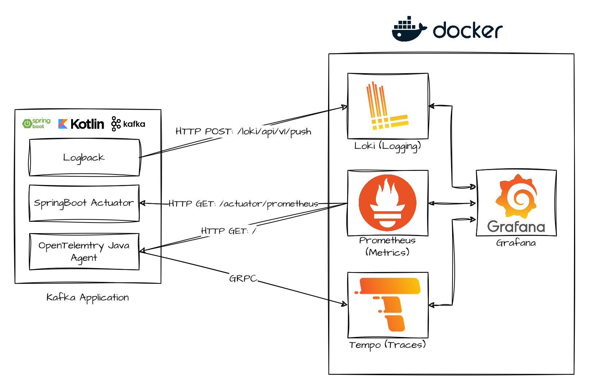

# 🔎 Kafka OpenTelemetry Example (with Grafana)

This repository provides a simple example to instrumenting Kafka JVM applications using the OpenTelemetry Java Agent.

This repository demonstrates how to auto-instrument Kafka applications using the OpenTelemetry Java Agent and collect
tracing, logging and metric information into a monitoring platform (Grafana).

The example focuses around the following:
- Auto-instrumenting Kafka applications using the OpenTelemetry Java Agent
- Exporting Tracing information into Tempo using the OpenTelemetry Java Agent
- Scraping the SpringBoot actuator using Prometheus server
- Scraping the OpenTelemetry Java Agent Prometheus endpoint using Prometheus  server
- Exporting Logs into Loki using Loki4j 
- Exploring the data in Grafana

⚠ **Disclaimer** ⚠: This is not a production ready example and is only intended to demonstrate how to auto-instrument Kafka
applications using the OpenTelemetry Java Agent. Applications like the OpenTelemetry Collector or Grafana Agent should
be used as a sidecar to the application to collect the data and export it to a monitoring platform. 

## 📚 Repository Contents
- Example Kafka Producer (SpringBoot)
- Example Kafka Streams Processor (SpringBoot)
- Example Kafka Consumer (SpringBoot)
- Scripts to run the example
  - setup.sh 
  - run-producer.sh
  - run-streams-processor.sh
  - run-consumer.sh
- Docker compose file to setup environment
  - Kafka Broker
  - Confluent Control Center
  - Zookeeper
  - Grafana
  - Prometheus (Metrics)
  - Loki (Logging)
  - Tempo (Tracing)

## ❓ About this example
The repository contains three Kafka applications that all integrate together and connect with the Kafka broker that is
running in the docker compose environment. These applications are written in Kotlin and use the SpringBoot framework and
run on the JVM.

I chose to write the applications in Kotlin to demonstrate the versatility of the OpenTelemetry Java Agent and how it
can instrument applications written in any JVM language.

Upon running the example, the applications will produce messages to the Kafka broker, the Kafka Streams processor will
process the messages and the consumer will consume the messages. 

### 🏫 Architecture
**Environment Architecture**

**Application Architecture**

## 🏃‍♀️ Running the example

### Prerequisites
This example works on both Windows or Linux. If running on Windows please use MINGW64 or WSL to run bash scripts.
- Docker
- Docker Compose
- Java 17+
- Bash

**Note**: if you are running on Linux you will need to update the docker-compose.yml file and uncomment the prometheus containers' `extra_hosts` config for linux and comment out the "host-gateway" line above.

### Actually running the example
1. Clone the repository
2. Run `./scripts/setup.sh` and wait a few minutes for the environment to start
   - Downloads the OpenTelemetry Agent
   - Builds the applications
   - Starts the docker compose environment
3. Run `./scripts/run-producer.sh` to start the producer
   - Will auto create its topics
   - Start producing messages to the Kafka broker
4. Run `./scripts/run-streams-processor.sh` to start the streams processor
    - Will auto create its topics
    - Start processing messages from the Kafka broker
    - Start producing messages to the Kafka broker
5. Run `./scripts/run-consumer.sh` to start the consumer
   - Will auto create its topics
   - Start consuming messages from the Kafka broker
6. Open Grafana at http://localhost:3000
   - Explore logs, traces and metrics

